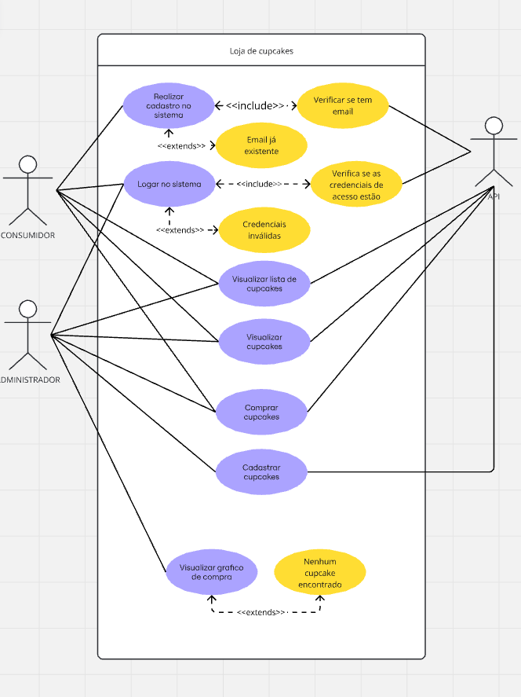
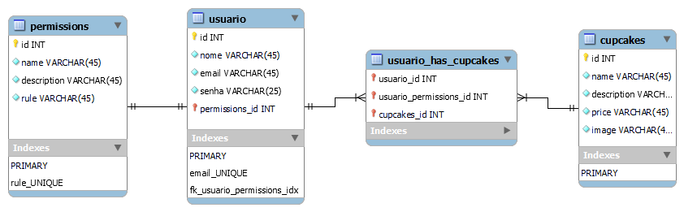

# Projeto integrador de software II (Paixão CakeShop)

## Índice

- [Descrição](#descrição)
- [Tecnologias Utilizadas](#tecnologias-utilizadas)
- [Configuração do Projeto](#configuração-do-projeto)
- [Uso](#uso)
- [Requisitos](#requisitos)
- [Diagrama de caso de uso](#diagrama-de-casos-de-uso)
- [Diagrama do banco de dados](#diagrama-do-banco-de-dados)
- [Casos de uso](#casos-de-uso)
- [Layout da aplicação](#layout-da-aplicação)

## Descrição

A aplicação a ser desenvolvida deve permitir que pessoas comprem cupcakes de maneira mais fácil, além de facilitar os responsáveis pela empresa.

## Tecnologias Utilizadas

- Frontend: HTML, CSS, TypeScript
- Framework: Angular
- Backend: Node.js, Express
- Banco de Dados: MySQL Workbench

## Configuração do Projeto

### Pré-requisitos

- Angular CLI
- Node.js (versão 14 ou superior)
- Express
- MySQL Workbench

### Instalação

1. Clone o repositório:
   ```
   gh repo clone lucaspaixaodev/projeto-integrador
   cd projeto-integrador
   ```

2. Instale as dependências do backend:
   ```
   cd cupcake-backend
   npm install
   ```

3. Instale as dependências do frontend:
   ```
   cd projeto-integrador
   npm install
   ```

4. Configure as variáveis de ambiente:
   - Crie um arquivo `.env` na pasta `cupcake-backend` com as seguintes variáveis:
     ```
     DB_HOST=localhost
     DB_USER=seu_usuario_aqui
     DB_PASSWORD=sua_senha_aqui
     DB_NAME=cupcake_store
     PORT=3000
     JWT_SECRET=sua_chave_secreta_aqui
     ```

### Executando a Aplicação

1. Inicie o servidor backend:
   ```
   cd backend
   npm run dev
   ```

2. Em outro terminal, inicie o frontend:
   ```
   cd frontend
   ng serve
   ```

3. Acesse a aplicação em `http://localhost:4200`

## Uso

1. Faça login ou crie uma nova conta
2. Adicione cupcakes ao carrinho
3. Finalize a compra

## Requisitos

- [Requisitos do usuário](./documentacao/requisitos/requisitos-usuario.md)
- [Requisitos Funcionais](./documentacao/requisitos/requisitos-funcionais.md)
- [Requisitos Não Funcionais](./documentacao/requisitos/requisitos-nao-funcionais.md)

## Diagrama de casos de uso



## Diagrama do banco de dados

A aplicação terá três tabelas, `users`, `locais` e `objetos`. No diagrama abaixo é possível ver os detalhes de cada uma dessas tabelas e como elas se relacionam.



<!-- ## Layout da aplicação

Abaixo estão os links para acessar os [wireframes](https://wireframe.cc/) e [mockups](https://www.figma.com/) da aplicação.

- [Wireframes](https://)
- [Mockups](https://www.figma.com) -->
